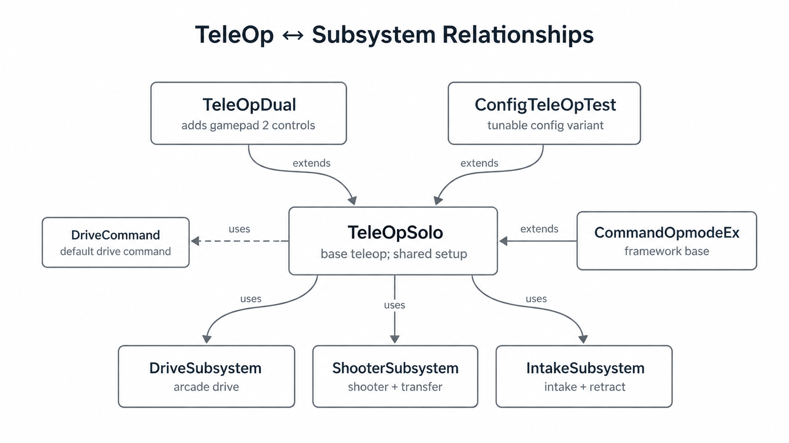

# Programming Engineering Notebook

## Software Architecture: SolversLib Command-Based Structure

Our robot code uses SolversLib's command-based structure to keep control logic organized. Instead of placing every motor action inside one large TeleOp file, we separated the robot into subsystems such as `DriveSubsystem`, `ShooterSubsystem`, and `IntakeSubsystem`, then used commands like `DriveCommand` to connect driver input to robot behavior.

This makes the TeleOp code act more like a control layer, while each subsystem owns the hardware details for one mechanism. The result is code that is easier to test, tune, and update during build season.

We also used inheritance with `TeleOpDual extends TeleOpSolo`. The dual-driver mode reuses the setup from the solo-driver mode and only changes the parts that need a second gamepad.

## Shooter Velocity Control and Algorithm Testing

One of the most important programming challenges was controlling the shooter. The shooter needs stable wheel speed to launch game pieces consistently. Using a fixed raw power, such as `1.0`, is simple, but it does not guarantee the same actual speed because battery voltage, friction, motor load, and feeding a game piece can all affect the shooter.

To improve consistency, we used velocity-based shooter control with motor encoders. Encoders allow the program to measure the real shooter speed, compare it with a target velocity, and adjust motor output based on feedback. This is better than raw power because shooting accuracy depends on wheel speed, not just the power value being sent to the motors.

We tested three shooter control strategies:

- PID control
- Take Back Half control
- Bang-bang control

For all three methods, the basic error is:

`error = targetVelocity - currentVelocity`

PID control uses proportional, integral, and derivative terms to reduce this error:

`output = Kp * error + Ki * integral(error) + Kd * derivative(error)`

It is flexible and precise, but it requires careful tuning. Take Back Half control is also designed for feedback-based flywheel control. It increases or decreases output based on the error, and when the error crosses zero, it averages the current output with the previous take-back-half value:

`output = (output + tbh) / 2`

Bang-bang control is the simplest method. It uses full power when the shooter is below the target range, then switches to a hold power:

`output = fullPower if currentVelocity < targetVelocity - deadband`

`output = holdPower otherwise`

To compare these methods, we mainly used average error. Each shooter test file included an `updateErrorRecording` method that could start and stop error recording during a run. While recording, the program added the current velocity error to a running sum and counted the number of samples. When recording stopped, it calculated the average error by dividing the total error by the number of samples.

## Driver Feedback: Gamepad Rumble

We added gamepad rumble as software feedback for the drivers. When the shooter velocity reaches the target range, the controller vibrates to tell the driver that the robot is ready to shoot.

This helps the driver focus on the field instead of constantly watching telemetry. The rumble feedback turns sensor data into a simple physical signal, making the robot easier to operate during a match.
