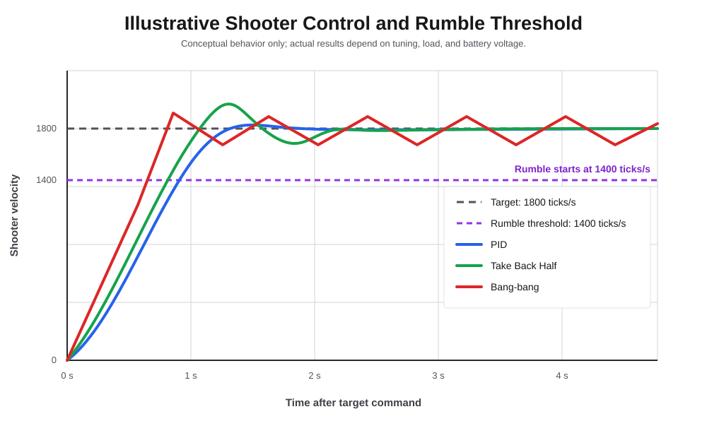

# Programming Engineering Notebook

## Software Architecture: SolversLib Command-Based Structure

Our robot code uses SolversLib's command-based structure to keep control logic organized. Rather than placing every motor action in one large TeleOp file, we separate the robot into subsystems such as `DriveSubsystem`, `ShooterSubsystem`, and `IntakeSubsystem`, while commands such as `DriveCommand` connect driver input to robot behavior. This keeps TeleOp as a control layer and lets each subsystem own its hardware details, making the code easier to test, tune, and update. We also use inheritance with `TeleOpDual extends TeleOpSolo`, so dual-driver mode reuses the solo-driver setup and only changes the controls needed for the second gamepad. `ConfigTeleOpTest` also extends `TeleOpSolo` and exposes shooter PIDF, mechanism power, and drive-speed settings for live adjustment through FTC Dashboard during testing.


## Shooter Velocity Control and Algorithm Testing

The shooter needs stable wheel speed for consistent launches, so we used motor encoders to measure velocity and compare it with a target instead of relying on fixed motor power. For every method, the velocity error is `e = targetVelocity - currentVelocity`; PID calculates `output = Kp × e + Ki × ∫e dt + Kd × de/dt`, TBH updates `output = output + gain × e` and, when the error crosses zero, uses `output = (output + tbh) / 2`, while bang-bang uses `output = fullPower` when `currentVelocity < targetVelocity - deadband` and `holdPower` otherwise. Each test recorded error samples during a driver-selected interval and reported their average to compare how closely the methods held the target speed.

| Algorithm | How it controls velocity | Advantages | Limitations |
| --- | --- | --- | --- |
| PID | Continuously corrects velocity error with proportional, integral, and derivative terms | Precise control and good steady-state accuracy | Requires careful gain tuning |
| Take Back Half (TBH) | Adjusts output from error and averages output when error crosses zero | Simple flywheel feedback method with automatic correction after overshoot | Depends on a good initial output estimate and gain |
| Bang-bang | Switches between full power and hold power around a velocity deadband | Very simple and quick to implement | Can oscillate around the target and offers less precise speed control |



## Driver Feedback: Gamepad Rumble

We added gamepad rumble as software feedback for the drivers. When the shooter velocity reaches the target range, the controller vibrates to tell the driver that the robot is ready to shoot. This lets the driver focus on the field instead of constantly watching telemetry, turning sensor data into a simple physical signal that makes the robot easier to operate during a match.


## Open-source Automatic PIDF Tuning Library

We developed a  **Shooter AutoTune library** to make shooter tuning repeatable. A webpage hosted on the Robot Controller lets us configure hardware, monitor experiments, and export gains：

```text
Unloaded power steps → Fit feedforward model → Validate at multiple speeds
    → Test P → Test D if needed → Test I if needed
    → Driver-fed shot tests → Export constants
```

`FeedforwardTuner` records voltage, velocity, and acceleration across power steps, then uses least-squares fitting to estimate kS, kV, and kA. `VelocityController` then applies:

```text
error = targetVelocity - measuredVelocity
commandVolts = kS + kV*targetVelocity + kA*targetAcceleration
               + kP*error + kI*integral(error) - kD*filteredAcceleration
motorPower = clamp(commandVolts / batteryVoltage, 0, 1)
```

Feedforward estimates the voltage; PID corrects the remainder, with integral clamping and derivative filtering for stability.

`PIDTuner` tests proportional gains first, adding derivative gains if overshoot exceeds **8%** and integral gains if steady-state error exceeds **2%**. `PerformanceMetrics` scores candidates on RMSE, overshoot, steady-state error, and recovery time.

During loaded tests, the driver feeds shots once the shooter stabilizes; the tuner compares nearby gains, measures recovery, and verifies the chosen gains before exporting constants。

`AutoTuneManager` coordinates these stages in the`tuner-core`, letting the integration layer own motors/webpage and enabling simulation testing and Maven reuse across projects.

## Intake Retraction Restriction: Sensor Selection

The intake must stop retracting reliably at its home position. Without a position restriction, the motor can continue pulling after the intake is fully retracted, which can strain the mechanism and make the starting position inconsistent.

After evaluating the available options, we selected a magnetic limit switch. A magnet mounted on the moving intake triggers the switch at the retracted position, allowing the program to stop the motor and reset its reference position.

| Sensor choice | Advantages | Disadvantages |
| --- | --- | --- |
| Motor internal encoder | No additional sensor hardware; provides continuous position data | Position can become inaccurate from slip, load, or missed motion |
| Touch sensor | Simple direct end-stop detection; easy to program | Repeated physical contact can reduce durability |
| Magnetic limit switch | Non-contact detection; reliable and durable for repeated retraction cycles | Requires accurate magnet/switch alignment and an added magnet |

## Vision: AprilTag Detection on Suppression Units

We use a Logitech C270 UVC USB Camera to locate the AprilTags mounted on the **SUPPRESSION UNITS**. The camera streams frames to the robot-control software, where an AprilTag processor detects each visible tag and reports its ID and position relative to the robot. This gives the robot a field reference that can be used to identify the correct suppression unit and support more accurate autonomous alignment.
